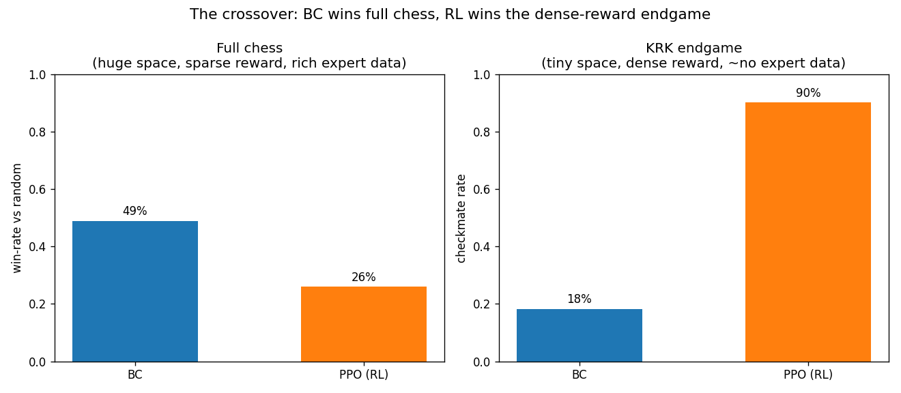
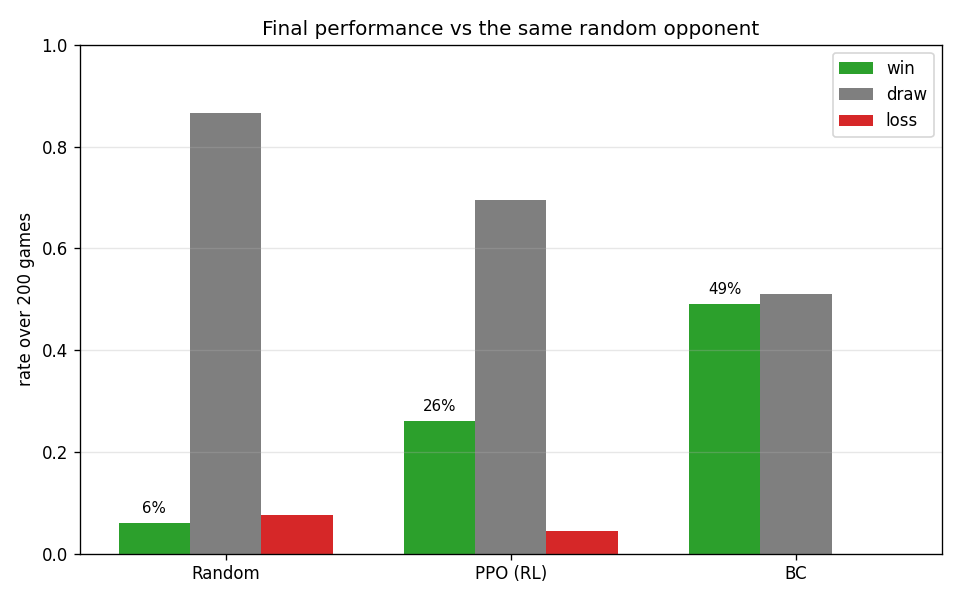
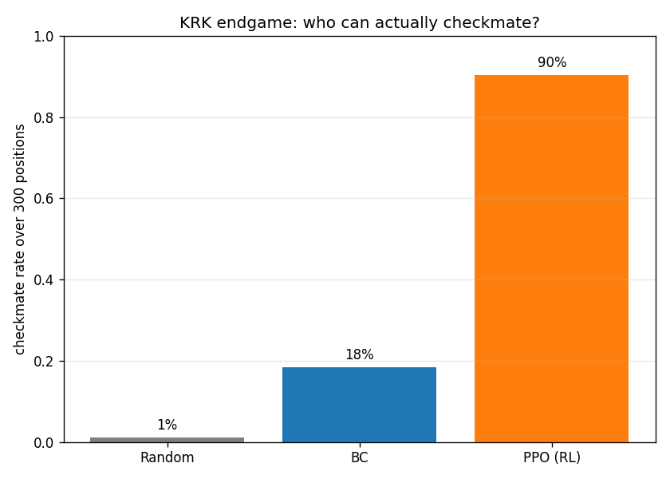
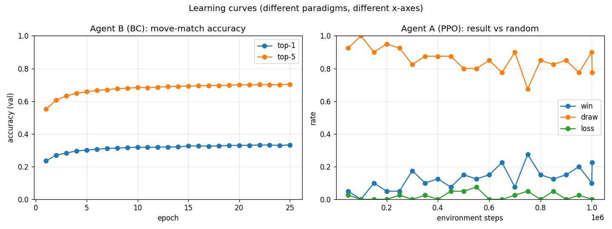
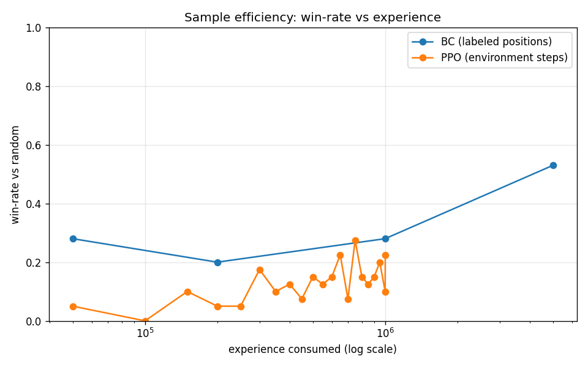

# PPO vs Behavioral Cloning on Chess — *When does each paradigm win?*

A university minor project that compares two learning paradigms on the **same task**
with the **same neural network**, to find out **when and why** one beats the other:

* **Agent A — Reinforcement Learning (PPO)** learns by *playing* and receiving rewards.
* **Agent B — Behavioral Cloning (BC)** learns by *imitating* expert moves from real games.

The headline finding is a **crossover**: with the identical network, the winner *flips*
depending on the task.

| Task | Winner |
|------|--------|
| **Full chess** (huge space, sparse reward, lots of expert data) | **Behavioral Cloning** |
| **King + Rook vs King endgame** (tiny space, dense reward, ~no expert data) | **Reinforcement Learning** |



> **One-sentence thesis:** *Behavioral Cloning wins when expert data is abundant and the
> reward is sparse; Reinforcement Learning wins when the reward is dense and the state
> space is small enough to explore — and chess lets us demonstrate **both** with the
> exact same network.*

---

## Table of contents
- [Results](#results)
- [How the comparison is kept fair](#how-the-comparison-is-kept-fair)
- [Repository structure](#repository-structure)
- [Installation](#installation)
- [Reproducing the results](#reproducing-the-results)
- [Method details](#method-details)
- [Honest limitations](#honest-limitations)
- [Hardware & runtime](#hardware--runtime)
- [Data & acknowledgements](#data--acknowledgements)

---

## Results

All numbers use the **same 1,577,728-parameter network** for both agents.

### 1. Full chess — Behavioral Cloning wins

Win/draw/loss vs the **same** random opponent (200 games):

| Agent | Win | Draw | Loss |
|-------|-----|------|------|
| Random baseline | 6% | 86% | 8% |
| Agent A — PPO (RL) | 26% | 70% | 4% |
| **Agent B — BC** | **49%** | 51% | **0%** |

**Head-to-head, BC vs PPO** (200 games, seeded random openings, colours swapped):
**BC 70 wins · PPO 0 wins · 130 draws.**



### 2. KRK endgame — Reinforcement Learning wins

Checkmate rate over 300 random King+Rook-vs-King positions (same positions for all agents):

| Agent | Checkmate rate | Avg. plies to mate |
|-------|----------------|--------------------|
| Random | 1% | — |
| Agent B — BC | 18% | ~47 |
| **Agent A — PPO (RL)** | **90%** | ~33 |

PPO **learns to checkmate from scratch**; the same BC network that wins full chess only
manages 18%, because human game databases contain almost no KRK technique (players resign
long before).



### 3. Learning curves & sample efficiency

* **BC** converges to ~33% top-1 move-match accuracy (70% top-5) — the capacity ceiling
  of a small MLP.
* **PPO** climbs from ~5% to a noisy ~10–28% win-rate vs random over 1M steps.
* On the **sample-efficiency** axis, BC reaches PPO's plateau with far less experience.




---

## How the comparison is kept fair

The project's central design rule: **the only thing that should differ between the two
agents is the learning paradigm** — not the inputs, not the action space, not the model.
This is enforced by sharing code:

* **One observation encoding** — `encode_board()` in [`chess_env.py`](chess_env.py)
  produces an `8×8×12` one-hot tensor, always from the side-to-move's perspective.
* **One action space** — `Discrete(4096)` = 64 from-squares × 64 to-squares, with
  legal-move masking (`get_action_mask()`).
* **One neural network** — a shared trunk `Flatten → 768 → 512 → 256` in
  [`network.py`](network.py). BC adds a `Linear(256, 4096)` move head; PPO reuses the
  **same trunk** as a Stable-Baselines3 features extractor with linear policy/value heads
  (`net_arch=[]`), giving an architecturally identical action head.

Both agents are evaluated against the **same opponent with the same seeds**.

---

## Repository structure

| File | Role |
|------|------|
| [`chess_env.py`](chess_env.py) | Gymnasium chess environment **+ shared primitives** (encoding, move↔action mapping, action masking). The foundation both agents build on. |
| [`network.py`](network.py) | The **shared neural network**: trunk + BC head, and the SB3 `policy_kwargs` so PPO reuses the same trunk. |
| [`data.py`](data.py) | Downloads the Lichess Elite Database and builds the BC dataset of `(board, expert-move, game-id)` triples. |
| [`train_bc.py`](train_bc.py) | **Agent B (BC):** trains the network as a 4096-way move classifier. |
| [`train_ppo.py`](train_ppo.py) | **Agent A (RL):** trains MaskablePPO vs a random opponent with optional reward shaping. |
| [`evaluate.py`](evaluate.py) | Plays both agents vs the same opponent + head-to-head, under identical conditions. |
| [`sample_efficiency.py`](sample_efficiency.py) | Win-rate vs amount of experience consumed (BC dataset size vs PPO env-steps). |
| [`krk_env.py`](krk_env.py) | The **King+Rook-vs-King endgame** environment (dense shaped reward). |
| [`train_krk.py`](train_krk.py) | Trains PPO (same shared trunk) to checkmate in the endgame. |
| [`krk_compare.py`](krk_compare.py) | BC vs PPO vs random on the endgame **+ the crossover figure**. |
| [`plots.py`](plots.py) | Generates all figures and the results table. |
| `runs/` | Saved models, metrics (JSON), and plots. |
| `data/` | Downloaded PGN zips and the built dataset (`bc_dataset.npz`). |

---

## Installation

```bash
git clone https://github.com/EdddTri/PPOvsBC_Chess.git
cd PPOvsBC_Chess

python -m venv venv
# Windows:  venv\Scripts\activate
# Linux/Mac: source venv/bin/activate

pip install -r requirements.txt
```

> **GPU note:** `requirements.txt` installs the CPU build of PyTorch. For an NVIDIA GPU,
> install the matching CUDA wheel instead, e.g.
> `pip install torch --index-url https://download.pytorch.org/whl/cu128`.
> Everything runs on CPU too, just slower for the BC training.

---

## Reproducing the results

The full pipeline, in order. (Pretrained weights are included under `runs/`, so you can
skip straight to evaluation if you prefer.)

```bash
# --- Step 1+2 are libraries (no run needed); self-tests:
python chess_env.py
python network.py

# --- Step 3: Behavioral Cloning ---------------------------------
python data.py --months 2024-11 2024-10 2024-09 --max-positions 5000000
python train_bc.py --epochs 25 --batch-size 4096

# --- Step 4: Reinforcement Learning (full chess) ----------------
python train_ppo.py --timesteps 1000000

# --- Step 5: Evaluate both, same conditions ---------------------
python evaluate.py --games 200
python sample_efficiency.py

# --- Crossover experiment: KRK endgame --------------------------
python train_krk.py --timesteps 2000000
python krk_compare.py --positions 300

# --- Step 6: All plots + summary table --------------------------
python plots.py
```

Outputs land in `runs/` (models + `*_metrics.json`) and `runs/plots/`
(`crossover.png`, `final_performance.png`, `learning_curves.png`,
`sample_efficiency.png`, `krk_mate_rate.png`, `win_rate_table.md`).

---

## Method details

**Observation.** `8×8×12` one-hot (6 piece types × 2 colours), always rendered from the
side-to-move's perspective (black-to-move boards are mirrored), so a single network plays
either colour. Stored compactly as `int8` codes and expanded to one-hot on the fly
(5M positions ≈ 45 MB on disk instead of ~15 GB).

**Action space.** `Discrete(4096)`; promotions default to a queen. Most actions are illegal
in any position, so we use **action masking** (MaskablePPO for RL; masked argmax for BC).

**Agent B (BC).** Cross-entropy classification of the expert's move, trained on **5M
positions from 57,497 strong human games** (Lichess Elite, 2400+/2500+ players). The
train/validation split is **by game** (whole games held out) to avoid leakage.

**Agent A (PPO).** `sb3-contrib` MaskablePPO vs a fixed random opponent. Terminal reward
+1/−1/0, plus a small **material-swing** shaping term so the otherwise-sparse signal is
learnable within ~1M steps.

**KRK endgame.** A reduced task with a **dense, hand-engineered** reward (drive the enemy
king to an edge/corner, confine its mobility, bring the friendly king up, big bonus for
mate). PPO is trained directly in this environment; BC is the same full-chess model,
evaluated here.

---

## Honest limitations

Stated plainly so the results are not over-claimed:

* **Lightweight by design.** A few-layer MLP on a flattened board, no search, no
  convolutions, no game history (castling rights, en passant, repetition, and the 50-move
  counter are **not** encoded). This is a paradigm comparison, not a strong chess engine.
* **BC accuracy ceiling.** ~33% top-1 move-match is the limit of this small MLP, not of BC
  in general. (A position-level split would report ~33.8%; the leak-free game-level split
  gives 33.3% — the leakage effect was negligible here.)
* **The RL endgame win uses a shaped reward.** PPO did **not** learn KRK from a bare
  +1-for-mate signal; it needed the dense, human-designed shaping. That *is* the
  "dense-reward regime" the experiment is about — but it is reward engineering, not
  reward-free discovery.
* **PPO numbers.** 26% win-rate vs random is the final 200-game evaluation; 27.5% is the
  best 40-game evaluation seen during training.
* **"Experience" is not a single unit.** The sample-efficiency plot compares BC's *labeled
  positions* with PPO's *environment steps* — different things, but both measure how much
  data each paradigm consumed to reach a given strength.

---

## Hardware & runtime

Developed on an NVIDIA RTX 4050 Laptop GPU (CUDA torch). Approximate run times:

| Stage | Time |
|-------|------|
| Build 5M-position dataset | ~6 min |
| Train BC (5M positions, 25 epochs) | ~5 min (GPU) |
| Train PPO full chess (1M steps) | ~14 min |
| Train PPO KRK (2M steps) | ~28 min |
| Evaluation + plots | ~10 min |

PPO is **CPU-bound** on chess move generation (~1,300 env-steps/s), so the GPU mainly
accelerates BC training.

---

## Data & acknowledgements

* Expert games: **[Lichess Elite Database](https://database.nikonoel.fr/)** (curated from
  the [Lichess open database](https://database.lichess.org/), 2400+/2500+ players).
* Built with [python-chess](https://python-chess.readthedocs.io/),
  [PyTorch](https://pytorch.org/),
  [Stable-Baselines3](https://stable-baselines3.readthedocs.io/) /
  [sb3-contrib](https://sb3-contrib.readthedocs.io/), and
  [Gymnasium](https://gymnasium.farama.org/).

University minor project — educational use.
